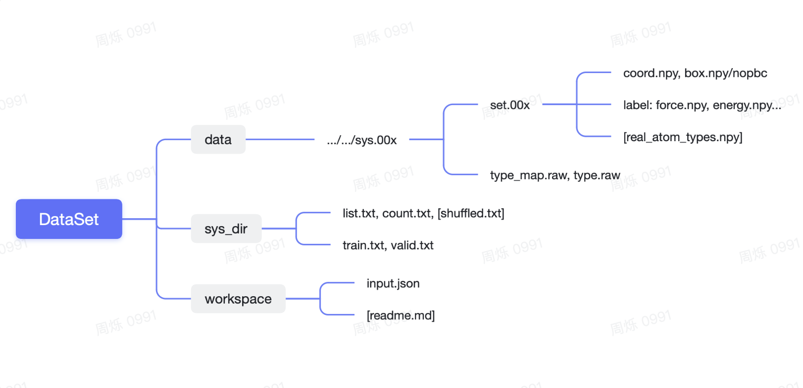

# DPA-tools

> 将dpgen数据集放在dpa_collect.sh同一目录下，运行 `sh dpa_collect.sh <sys_name>` 即可直接生成 sys_name.zip，按9：1划分训练集和测试集

## 1.1 数据集管理准则：分开data和训练脚本

**@周烁**标准化之后的数据集文件树，其中中括号表示非必需存在的可选文件

以OC(Open Catalyst)数据集为例， **数据文件夹分为以下部分** ：

* OC/data：数据主体部分，里面是各种sys的文件，内部结构不固定，根据下述sys_dir索引
* OC/sys_dir：数据目录（.txt文件），包括训练集、测试集划分，或者按照具体实验划分的目录文件，方便后续生成任务的训练脚本。注意如果我们用gen_list.py脚本，-p 一律填写绝对路径方便之后 count.py 探索，在不同机器上转移时只用更改数据集名称前面的部分即可。

**训练任务文件夹**分为以下部分：

* OC/workspace（按照实验名称设计的各种实验目录）
  * input.json
  * readme

我们以此为标准，后续的数据集都划分为data，sys_dir，workspace三个文件夹进行管理。

对于外部使用者，这里建议可以直接跳转至第二部分：数据集处理

## 1.2 data的数据格式

data数据的基本单元为system，通常以deepmd或者sys.开头为名的文件夹存储，内部往往分为两部分：

* .raw 文件，每一行是system的一个snapshot (快照)，称为frame（帧）
* set.00x 文件夹，由 `$deepmd_source_dir/data/raw/raw_to_set.sh` 脚本对.raw文件按一定数量的frame划分而成若干 Numpy 支持的 .npy 文件。（现已可以用dpdata一键处理）一般只有set.000一个

data的数据格式有两种，第一种是每个data包含的所有frame拥有相同的化学式，另一种是相同的原子数：

* Standard data format: 相同化学式，详情见：
  **[https://github.com/deepmodeling/deepmd-kit/blob/master/doc/data/system.md](https://github.com/deepmodeling/deepmd-kit/blob/master/doc/data/system.md)**
* Mixed type: 相同原子数，type.raw 会被全部置零，详情见：
  **[https://github.com/deepmodeling/deepmd-kit/blob/master/doc/model/train-se-atten.md#data-format](https://github.com/deepmodeling/deepmd-kit/blob/master/doc/model/train-se-atten.md#data-format)**

综上而言，简而概之，每个system文件夹核心的部分为：

* type.raw & type_map.raw 记录包含的原子名称与数目信息
* set.00x/ *.npy，*可以是坐标、受力、能量...等物理量，每一行代表一帧frame的数据
* nopbc 如果存在，系统就为非周期性的，否则就是周期性的

如果是第二种混合数据格式，还需额外的real_atom_types.npy，实际数据集中也可能同时存在转换前的物理量.raw

1. # 数据集处理

我们以HfTaCN数据集为例示范 [DPA 体系测试标准流程](https://dptechnology.feishu.cn/wiki/wikcncZ2b5vqELrAbqEW0P9z3Qe)的小工具处理流程，假设脚本存放在绝对路径/tools/下

我们需要确认count.py处理过程中没有出现"not a system in..."报错，也可以看结果，正常来说count.txt只应该比list.txt多出一行关于总的system数和frame数，只有这样才能保证训练过程中填入的目录里都是符合条件的system

用shuffle.py打乱前面的HfTaCN_list.txt生成头部和尾部的列表，再用set_train_valid.py生成input.json:

我们统一大致按照9:1取shuffled.txt的前十分之九为训练集，后十分之一为测试集

```Shell
> cd sys_dir
> python /tools/shuffle.py -i list.txt -o shuffled.txt
> wc -l shuffled.txt 
2316 shuffled.txt
> head -n 2100 shuffled.txt > train.txt
> tail -n 216 shuffled.txt > valid.txt
```

可以用**@刘建川**创建的脚本统一执行: `sh dpa_collect.sh <sys_name>`即可直接生成sys_name.zip。

如果需要的话还可以用 set_train_valid.py 操作生成input.json放到workspace下，这个脚本需要模版作为输入，我们这里放了from_scratch和multitask两种的模版，但这不是数据管理侧的任务，是实验设计侧的。

```Shell
> python /tools/set_train_valid.py -t train.txt -v valid.txt -i /tools/template.json -o ../workspace/input.json
```

可以找**@周烁**scp传输规范化之后的几种数据集，目前dpa-data:antientropy镜像下~/data存放所有整理好的。

registry.dp.tech/dptech/prod-13433/dpa-data:antientropy
